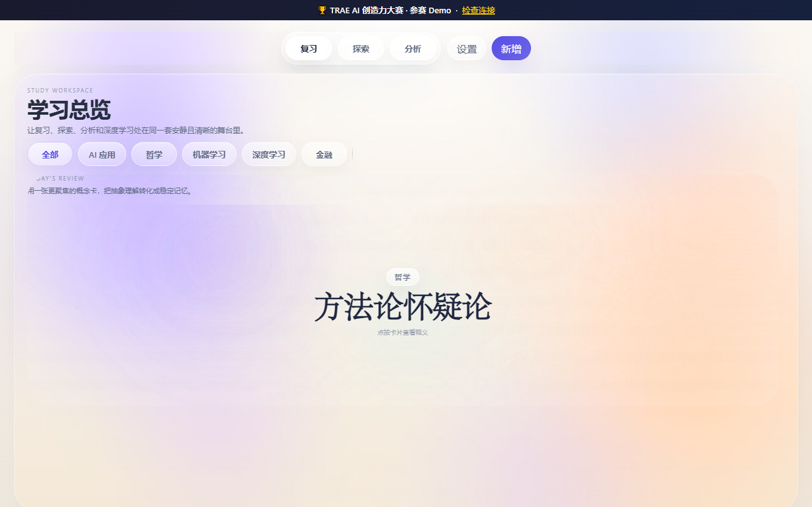
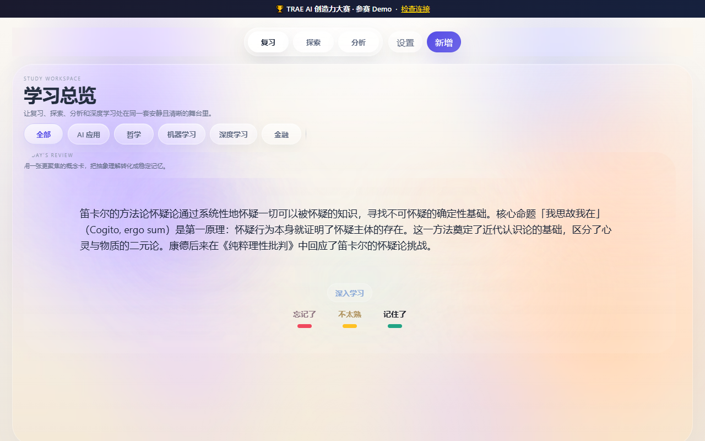
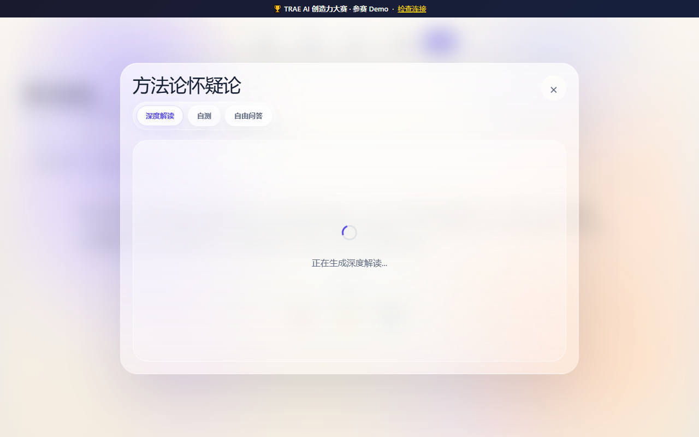
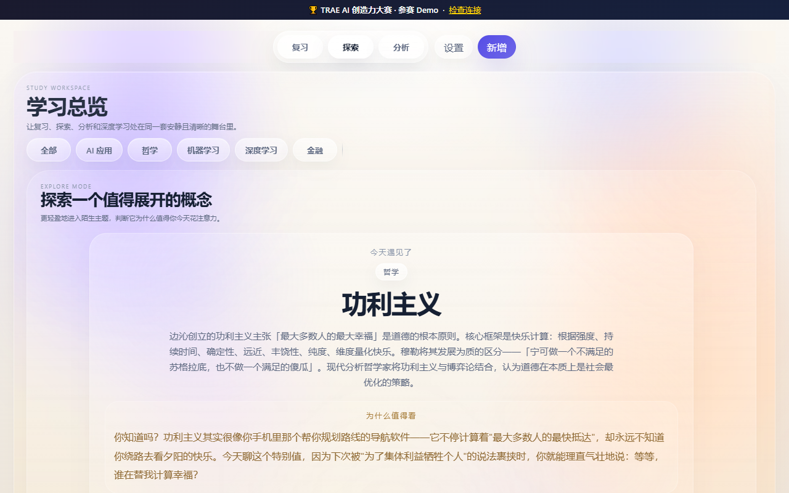
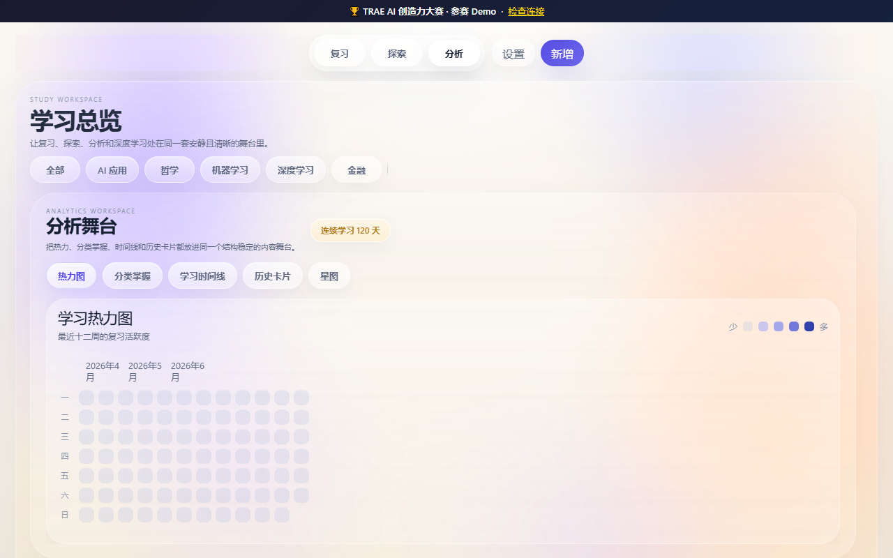
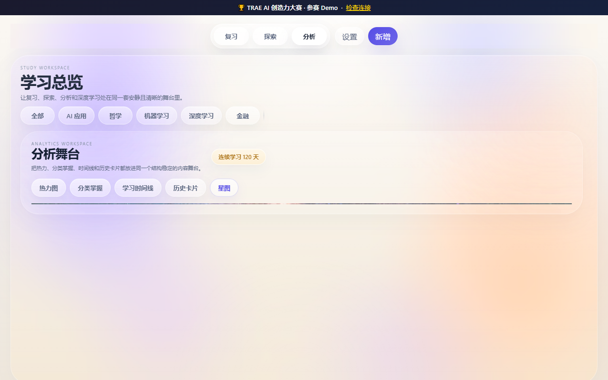

# 概念复习 — TRAE AI 创造力大赛 参赛提交材料

## 一、参赛信息

| 项目 | 内容 |
|------|------|
| **作品名称** | 概念复习 — 沉浸式知识管理工具 |
| **通用赛道** | 学习工作（造个新解法） |
| **附加赛题** | — |
| **创作工具** | TRAE IDE（中国版） |
| **开发模式** | SOLO 模式 |

## 二、Demo 简介

概念复习是一款基于**间隔重复**（Spaced Repetition）的沉浸式知识管理工具。它帮助学习者在日常复习中自动调度概念卡片，并通过**星图**（Star Map）可视化展示知识之间的关联网络，实现从「背概念」到「理解概念关系网」的认知升级。

核心功能包括：
- **智能复习**：基于 SM-2 算法自动安排复习计划，高效巩固记忆
- **知识星图**：可视化概念图谱，一目了然看到知识网络结构
- **深度学习**：对概念进行深入解析，支持追问探索
- **随机探索**：随机抽取概念，发现知识盲区
- **统计分析**：复习进度可视化，掌握学习节奏
- **知识碰撞**：关联概念横向对比，加深理解

本 Demo 预置了 **25 个概念**，覆盖 AI/深度学习、金融、哲学、机器学习四个知识领域，开箱即用，无需任何配置。

## 三、创作思路

### 3.1 为什么做这个产品？

日常学习中，我们常常陷入"学完就忘"的困境：知识点零散、复习效率低下、难以建立知识之间的联系。现有的学习工具要么过于简单（纯间隔重复），要么过于复杂（真正的知识图谱系统）。概念复习在两者之间找到了平衡点——用间隔重复确保记忆效率，用轻量星图帮助理解概念间的关系。

### 3.2 技术选型

- **后端**：Python Flask REST API，无数据库依赖，JSON 文件存储，零配置即可运行
- **前端**：纯 HTML/CSS/JavaScript，SPA 单页应用，无需前端构建工具
- **核心算法**：SM-2 间隔重复算法（SuperMemo 算法改良版）
- **原有架构**：桌面版基于 pywebview（Python + Web 混合应用）

### 3.3 比赛改造策略

本次改造遵循「最小改动」原则：
1. **复用 95% 现有代码**：后端业务逻辑（backend.py）零改动，仅新增 `config_file` 参数支持
2. **新增 Flask 层**：`web_app.py` 提供 REST API，替代 pywebview 的后端桥接
3. **前端适配层**：`api_adapter.js` 统一 `window.api` 接口，自动检测运行环境
4. **匿名会话隔离**：每个浏览器用户自动分配独立数据会话，互不干扰
5. **演示数据预置**：25 个概念 + 互联关系，开箱即体验

### 3.4 技术亮点

- 桌面版和网页版**代码高度共享**，同一套代码可在两种模式下运行
- **无需 API Key** 即可完整体验，评委零门槛上手
- 匿名会话支持多人同时体验，互不干扰
- 全部代码由 **TRAE IDE SOLO 模式** 生成和迭代

## 四、Trae 开发留痕

### 4.1 开发过程关键步骤

1. **理解现有代码**：先读取 backend.py、frontend/app.js、frontend/index.html 等核心文件
2. **重构 backend.py**：新增 `config_file` 显式参数，维持桌面版兼容性
3. **创建 web_app.py**：30 个 REST API 端点 + 匿名会话隔离 + 演示数据自动播种
4. **创建 api_adapter.js**：统一 `window.api` 接口，自动检测 pywebview/fetch 模式
5. **全局替换**：将 app.js 中 32 处 `window.pywebview.api.xxx()` 替换为 `api.xxx()`
6. **修复字段一致性**：将 config 端点和模板统一使用 `bk.get_api_key()` 入口
7. **补充演示数据**：从 0 构建 25 个跨学科概念的数据集
8. **设置页兼容**：网页版演示模式下自动切换到只读状态展示
9. **自动化测试**：44 项测试全部通过（13 项原有 + 31 项新增 Web API 测试）

### 4.2 开发截图

| 截图 | 说明 |
|------|------|
|  | 复习模式 - 卡片正面（概念名称） |
|  | 复习模式 - 卡片背面（释义 + 深入学习按钮） |
|  | 深度学习面板 - 深度解读 + 自测 + 自由问答 |
|  | 探索模式 - 随机概念推荐 |
|  | 分析模式 - 热力图 |
|  | 知识星图 - 可视化概念关联网络 |

> 所有截图均为实际运行效果，无需 API Key，开箱即用。

### 4.3 会话日志

每次启动后自动生成匿名会话，每个浏览器用户独立隔离。

**历史 Session ID 示例：**
- `7cee742d60744443` — 首次演示播种
- `a102ba286c714c8f`
- `bde530c43bb94ac9`
- `c66fd7a8c8e0444a`
- `50613f312bad44a6`
- `d5cc5eabd38e46fa`
- `04f15c92033e43de` — 最新调试会话

`trae_web_session.log` 自动记录每个 API 请求及其 Session ID，可用于验证 Trae 开发全过程留痕。

## 五、运行指南

### 快速启动

```bash
cd 概念复习应用
pip install flask>=3.0
python web_app.py
# 浏览器打开 http://localhost:8765
```

### 项目结构

```
概念复习应用/
├── web_app.py              # Flask 网页入口（新增）
├── backend.py              # 核心 SM-2 算法（零改动）
├── frontend/
│   ├── index_web.html      # 网页版入口（新增）
│   ├── app.js              # 前端 SPA 逻辑（适配改造）
│   ├── api_adapter.js      # API 适配层（新增）
│   └── style.css           # UI 样式（零改动）
├── data/
│   └── demo_seed.json      # 25 个预置概念（新增）
├── tests/
│   └── test_web_api.py     # 44 项 Web API 测试
└── 比赛提交材料.md
```

### 部署建议

- 本地演示：直接 `python web_app.py` 运行
- 公网体验：使用 `flask run --host=0.0.0.0 --port=8765` 配合内网穿透（如 frp/ngrok）
- Docker 部署：可构建轻量 Python 镜像，无需数据库

## 六、作品链接

- **本地体验**：`http://localhost:8765`（启动后）
- **社区帖子**：[TRAE 官方社区 · 大赛报名专区]
- **GitHub**：（可选公开仓库）

---

*TRAE AI 创造力大赛参赛作品 · 2026*